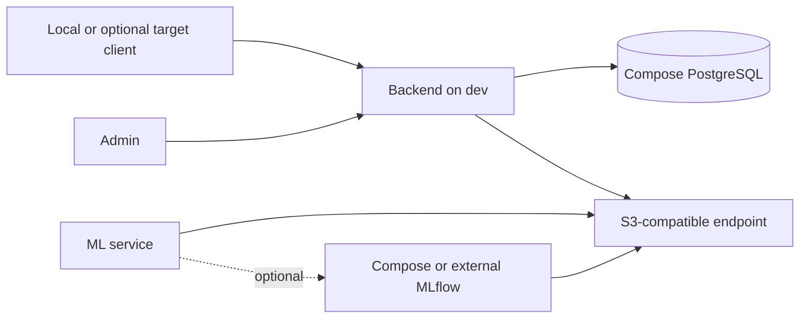
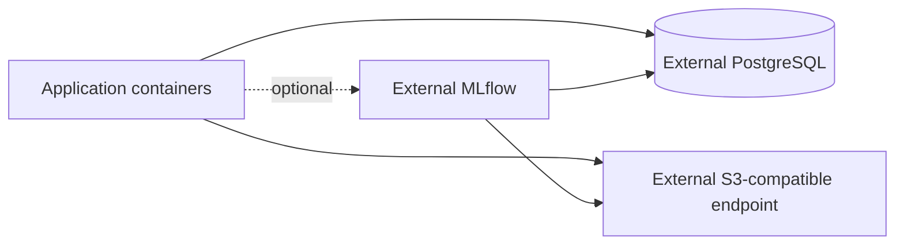

# Architecture

The parent repository is a control workspace for five independent Git
repositories. Application code remains owned by backend, admin, client, ML, and
infra repositories with independent branches, commits, PRs, and releases.

The project is pre-1.0. Earlier unreleased component versions are not
compatibility targets; the current repositories must form one coherent,
validated system. Breaking changes are coordinated across affected
repositories. This policy will be replaced before the first intentional
production release by explicit stability, compatibility, versioning, migration,
and supported-upgrade rules.

Object storage is a provider-neutral S3-compatible contract. Application code
uses standard bucket availability/creation (dev-only when enabled), list, put,
get, delete, metadata, content-type, and multipart behavior supplied by the S3
SDK. It does not manage provider users, consoles, replication, log formats,
versioning extensions, or bucket policies. Endpoint, region, credentials,
session token, TLS verification, addressing style, timeouts, and retry behavior
are configuration. No permanent S3 provider is selected.

## Development

Compose starts application services and local PostgreSQL. MLflow and Label
Studio are optional overlays. S3 is either an external endpoint or a provider
attached through a replaceable overlay. Named volumes contain only dev state
and may be rebuilt.

The optional `dev-client` computer runs the desktop client natively in its
inspected runtime environment. It consumes development APIs from `dev` but
does not host Compose services. Local desktop builds remain supported when the
target is absent.

## Production

Production Compose contains application containers only. PostgreSQL, S3, and
optional MLflow are external dependencies supplied through configuration; no
application Compose dependency or local stateful volume is required.
