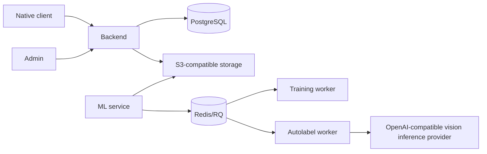

# Architecture

The workspace coordinates five independent repositories: admin, backend, client,
infra, and ML. Each owns its own source, tests, and history. The workspace
describes how current component revisions integrate; component changes are
committed separately after direct approval.

The application uses generic contracts: PostgreSQL, Redis/RQ where selected,
S3-compatible object storage, OpenID Connect when enabled, and a replaceable
OpenAI-compatible VLM inference provider. Concrete products, endpoints,
credentials, and network routing are environment configuration.

```mermaid
flowchart LR
  C[Native client] --> B[Backend]
  A[Admin] --> B
  B --> P[(PostgreSQL)]
  B --> S[S3-compatible storage]
  M[ML service] --> S
  M --> R[(Redis/RQ)]
  R --> T[Training worker]
  R --> V[Autolabel worker]
  V --> I[OpenAI-compatible vision inference provider]
```

Stateful-service placement and environment isolation are local operator
decisions. The portable contracts do not assume a host, topology, or provider.
