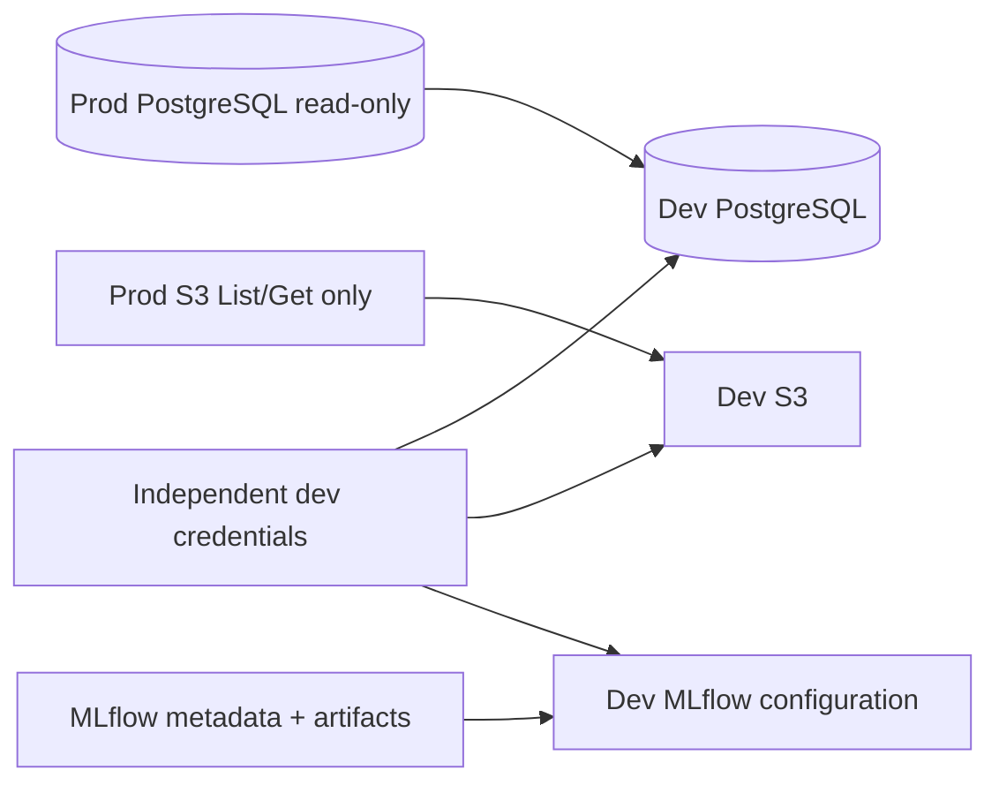

# Production-to-development data refresh

Data refresh is strictly `PROD → DEV`.

`self-checkout-infra/ops/data-refresh/prod-to-dev.sh` accepts `--dry-run`,
`--postgres`, `--s3`, `--mlflow`, `--all`, `--verify-only`,
`--snapshot-dev`, and the dev-only `--replace-dev`. It has no reverse,
push-to-production, or arbitrary source/destination mode.

The source and target must have independent marker files containing exactly
`prod` and `dev`. Stable `PROD_*` and `DEV_*` roles, distinct IDs, distinct
connections, production-looking target rejection, prior S3 dry-run records, and
exact destructive confirmations prevent direction reversal. PostgreSQL restore
requires `ODTWÓRZ DEV DB <database>`; full S3 replacement requires
`ODTWÓRZ DEV S3 <bucket>`.

The PostgreSQL source role needs connect and dump/read privileges only, without
write, DDL, role, extension, or administrative rights. Source S3 credentials
need `ListBucket` and `GetObject` (optionally version reads) and no put, delete,
bucket, or policy rights. MLflow source access is read-only where its API
supports it.

Domain data is copied unchanged and needs no anonymization because the system
does not store personal or privacy-regulated data. Infrastructure credentials,
tokens, SSH keys, environment files, private certificates, policies, and
production system configuration are never application data and are excluded.
Dev supplies its own credentials.

MLflow is not copied as an opaque directory. Metadata is restored with its
PostgreSQL backend and artifacts through S3, then production URIs are replaced
by dev configuration. The safe supported minimum requires both relationships to
be declared; installations with a different backend need an explicit reviewed
procedure before refresh.

Production PostgreSQL dumps live only in a mode-700 temporary run directory and
are removed on exit. Requested dev snapshots, secret-free operation logs, and
S3 manifests are retained in protected `refresh-snapshots`, `refresh-logs`, and
`refresh-manifests` directories; operators remove them under the environment
retention policy. Run the S3 stage once per approved source/target bucket pair,
including the MLflow artifact bucket when selected.
