# Git workflow

## Current audit

Audit date: 2026-07-22. All five application repositories are hosted on GitHub, have `main` as the remote default branch, have no tags, CI workflows, PR templates, versioned hooks, `CODEOWNERS`, `CONTRIBUTING.md`, `.gitattributes`, or `.editorconfig`, and currently have linear histories without merge commits. The control repository has no remote and no first commit.

| Repository | Current work branch | Remote `main...dev` | Current role of `dev` |
| --- | --- | ---: | --- |
| admin | `chore/workspace-control` | 0 behind / 6 ahead | temporary integration branch |
| backend | `chore/workspace-control` | 0 behind / 13 ahead | temporary integration branch |
| client | `chore/workspace-control` | 0 behind / 18 ahead | temporary integration branch |
| infra | `chore/workspace-control` | 0 behind / 8 ahead | temporary integration branch |
| ml | `chore/workspace-control` | 0 behind / 6 ahead | temporary integration branch |

No repository contains branch-triggered CI/CD or deployment configuration, so no code-level automation dependency on `dev` was found. Remote branch protection and repository rulesets cannot be read through Git transport and remain to be verified in GitHub settings. The admin repository tracks `.env`; do not expose it. Removing it from tracking, reviewing history, and rotating any real credentials is a separate security task.

## Target model

Use lightweight trunk-based development:

- `main` is the single long-lived integration branch.
- Work happens on short-lived branches and enters `main` through pull requests.
- A branch belongs to one repository even when the logical name matches branches in other repositories.
- Releases are immutable tags and image digests, not long-lived release branches.
- `dev` is temporary until its existing history and every deployment dependency are migrated.

```mermaid
flowchart LR
    A[Inspect workspace] --> B[Select affected repositories]
    B --> C[Fetch and create matching short-lived branches]
    C --> D[Implement focused change]
    D --> E[Sync to remote dev]
    E --> F[Repository checks and integration health]
    F --> G[Review separate diffs]
    G --> H[Atomic Conventional Commits]
    H --> I[Separate PR summaries]
    I --> J[Stop before push]
    J -->|explicit approval| K[Push and open separate PRs]
    K --> L[Squash merge in declared order]
```



## Branch names

Use `feat`, `fix`, `refactor`, `chore`, `docs`, `test`, `ci`, `security`, or `hotfix`, followed by a slash and a lowercase kebab-case description. A leading uppercase task identifier is allowed:

```text
feat/SC-123-payment-flow
fix/invalid-token
docs/git-workflow
```

For a multi-repository change, reuse the logical name only in affected repositories. Never create placeholder branches in unaffected repositories.

## Base branch and `dev` migration

`repos.yaml` currently sets `workflow_base_branch: dev` for all application repositories because `dev` contains all post-initial development. This is a temporary compatibility setting, not the target model.

Migrate each repository independently:

1. Finish and review current work targeting `dev`.
2. Re-run `git log origin/main..origin/dev`, `git log origin/dev..origin/main`, and `git diff --stat origin/main...origin/dev` after a fresh fetch.
3. Confirm GitHub Actions, external webhooks, image builds, and deployment scripts do not depend on `dev`.
4. Open a dedicated `dev` → `main` migration PR; do not rewrite either branch.
5. Validate repository checks and the complete integrated system on `dev` using the exact candidate SHAs.
6. Merge in dependency order: backend and ML contracts, clients/admin, then infra when infrastructure depends on the new artifacts. Adjust this order for the actual change.
7. Change `workflow_base_branch` to `main`, update branch rules and CI triggers, and observe one complete development cycle.
8. Keep `dev` read-only temporarily. Delete it only after explicit approval and verification that no automation or collaborator uses it.

Rollback for the migration is procedural: stop new merges, keep `dev` unchanged, revert the migration PR on `main` if necessary, restore CI triggers to `dev`, and re-run integration validation. Never reset or force-push `main`.

## Commits and merge strategy

Use `<type>(<scope>): <description>` with allowed types `feat`, `fix`, `refactor`, `perf`, `test`, `docs`, `build`, `ci`, `chore`, `revert`, and `security`. Write English imperative descriptions beginning with lowercase and without a final period. Mark breaking changes with `!` and a `BREAKING CHANGE:` footer.

Prefer small, reversible commits. Essential tests belong with their implementation; independent tooling, documentation, migrations, or refactors may be separate. Never add automatic Codex signatures or `Co-authored-by` trailers without explicit approval.

Use squash merge for ordinary feature and fix PRs. The squash title must be a Conventional Commit. Avoid incidental merge commits. Rebase only unpublished personal branches, or obtain approval before rewriting any published branch.

## Branch protection recommendations

For `main`, and for `dev` while it remains active:

- require a pull request and passing repository CI;
- block force-push and deletion;
- block direct pushes;
- require resolution of review conversations;
- require one approval when more than one active contributor exists;
- require the branch to be current only when the integration risk justifies the extra churn;
- require linear history when using squash merge.

These are recommendations only. No remote ruleset is changed by workspace tooling. Exact GitHub CLI/API commands must be prepared and reviewed after authenticated GitHub access and the final required status names are known.

## Codex checklist

Before implementation:

- [ ] Run `ops/repos-status.sh`.
- [ ] Identify affected repositories and read their `AGENTS.md` files.
- [ ] Show pre-existing changes and preserve ownership.
- [ ] Fetch with pruning and inspect remote divergence.
- [ ] Identify the configured base branch, tests, and integration risks.
- [ ] Create matching short-lived branches only where needed.

Before push:

- [ ] Sync with a dry-run followed by apply to `dev`.
- [ ] Run repository lint, tests, type checks, and builds.
- [ ] Validate Compose and integration health.
- [ ] Review full and staged diffs plus untracked files.
- [ ] Run `git diff --check` and secret/large-file checks.
- [ ] Validate every new commit message.
- [ ] Prepare separate PR descriptions and merge order.
- [ ] Obtain explicit approval to push.

Before merge:

- [ ] Required CI is green for the exact head SHA.
- [ ] Reviews and conversations are resolved.
- [ ] API, database, configuration, security, and Docker impacts are documented.
- [ ] Dependent PRs and merge order are explicit.
- [ ] Rollback is actionable.
- [ ] Squash title is a valid Conventional Commit.

Before release:

- [ ] All release commits are merged and immutable SHAs are recorded.
- [ ] Full integration validation passed on `dev`.
- [ ] Database compatibility and rollback were reviewed.
- [ ] Images are identified by digest and optional release tag.
- [ ] Release notes list component versions and known limitations.
- [ ] Production deployment has separate explicit approval.
