# Git workflow

## Current model

Migration decision: 2026-07-23. All five application repositories use `main` as the remote default and the only long-lived integration branch. Repository CI runs for pull requests and pushes targeting `main`. The legacy `dev` Git branches are not valid bases for new work and may be deleted after their migration pull requests are merged and their tips are confirmed reachable from `main`.

The SSH alias and host named `dev` remain the controlled development environment. References to syncing, testing, Docker, or health checks on `dev` refer to that host, not to a Git branch.

Remote branch protection and repository rulesets must be verified in GitHub settings. The admin repository tracks `.env`; do not expose it. Removing it from tracking, reviewing history, and rotating any real credentials is a separate security task.

## Target model

Use lightweight trunk-based development:

- `main` is the single long-lived integration branch.
- Work happens on short-lived branches and enters `main` through pull requests.
- A branch belongs to one repository even when the logical name matches branches in other repositories.
- Releases are immutable tags and image digests, not long-lived release branches.

```mermaid
flowchart LR
    A[Inspect workspace] --> B[Select affected repositories]
    B --> C[Fetch and create matching short-lived branches]
    C --> D[Implement focused change]
    D --> E[Sync to development host]
    E --> F[Repository checks and integration health]
    F --> G[Review separate diffs]
    G --> H[Atomic Conventional Commits]
    H --> I[Separate PR summaries]
    I --> J[Stop before push]
    J -->|explicit approval| K[Push and open separate PRs]
    K --> L[Squash merge in declared order]
```



## Branch names

Use `feat`, `fix`, `refactor`, `chore`, `docs`, `test`, `ci`, `security`, or `hotfix`, followed by a slash and a lowercase kebab-case description. A leading uppercase task identifier is allowed:

```text
feat/SC-123-payment-flow
fix/invalid-token
docs/git-workflow
```

For a multi-repository change, reuse the logical name only in affected repositories. Never create placeholder branches in unaffected repositories.

## Base branch

`repos.yaml` sets `workflow_base_branch: main` for every application repository. `ops/start-task.sh` must create work from the freshly fetched `origin/main`. Pull requests target `main`; a PR targeting another long-lived branch is a workflow error.

Do not recreate or reuse a Git branch named `dev`. The development host keeps its existing `dev` SSH alias and continues to provide Docker, integration, and health validation.

Rollback is procedural: stop new merges, revert the affected pull request on `main`, and re-run integration validation on the development host. Never reset or force-push `main`.

## Commits and merge strategy

Use `<type>(<scope>): <description>` with allowed types `feat`, `fix`, `refactor`, `perf`, `test`, `docs`, `build`, `ci`, `chore`, `revert`, and `security`. Write English imperative descriptions beginning with lowercase and without a final period. Mark breaking changes with `!` and a `BREAKING CHANGE:` footer.

Prefer small, reversible commits. Essential tests belong with their implementation; independent tooling, documentation, migrations, or refactors may be separate. Never add automatic Codex signatures or `Co-authored-by` trailers without explicit approval.

Use squash merge for ordinary feature and fix PRs. The squash title must be a Conventional Commit. Avoid incidental merge commits. Rebase only unpublished personal branches, or obtain approval before rewriting any published branch.

## Branch protection recommendations

For `main`:

- require a pull request and passing repository CI;
- block force-push and deletion;
- block direct pushes;
- require resolution of review conversations;
- require one approval when more than one active contributor exists;
- require the branch to be current only when the integration risk justifies the extra churn;
- require linear history when using squash merge.

These are recommendations only. No remote ruleset is changed by workspace tooling. Exact GitHub CLI/API commands must be prepared and reviewed after authenticated GitHub access and the final required status names are known.

## Codex checklist

Before implementation:

- [ ] Run `ops/repos-status.sh`.
- [ ] Identify affected repositories and read their `AGENTS.md` files.
- [ ] Show pre-existing changes and preserve ownership.
- [ ] Fetch with pruning and inspect remote divergence.
- [ ] Identify the configured base branch, tests, and integration risks.
- [ ] Create matching short-lived branches only where needed.

Before push:

- [ ] Sync with a dry-run followed by apply to the development host.
- [ ] Run repository lint, tests, type checks, and builds.
- [ ] Validate Compose and integration health.
- [ ] Review full and staged diffs plus untracked files.
- [ ] Run `git diff --check` and secret/large-file checks.
- [ ] Validate every new commit message.
- [ ] Prepare separate PR descriptions and merge order.
- [ ] Obtain explicit approval to push.

Before merge:

- [ ] Required CI is green for the exact head SHA.
- [ ] Reviews and conversations are resolved.
- [ ] API, database, configuration, security, and Docker impacts are documented.
- [ ] Dependent PRs and merge order are explicit.
- [ ] Rollback is actionable.
- [ ] Squash title is a valid Conventional Commit.

Before release:

- [ ] All release commits are merged and immutable SHAs are recorded.
- [ ] Full integration validation passed on the development host.
- [ ] Database compatibility and rollback were reviewed.
- [ ] Images are identified by digest and optional release tag.
- [ ] Release notes list component versions and known limitations.
- [ ] Production deployment has separate explicit approval.
